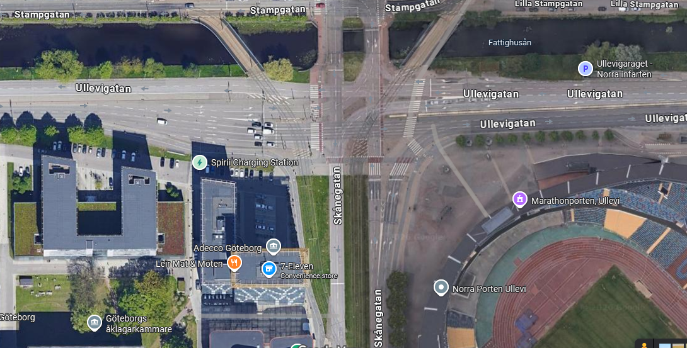
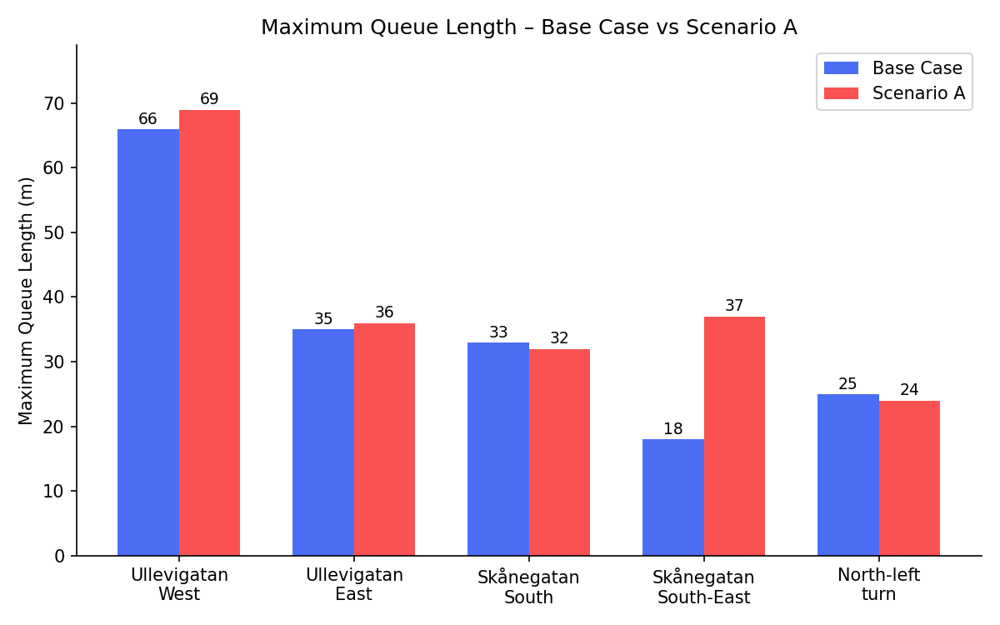
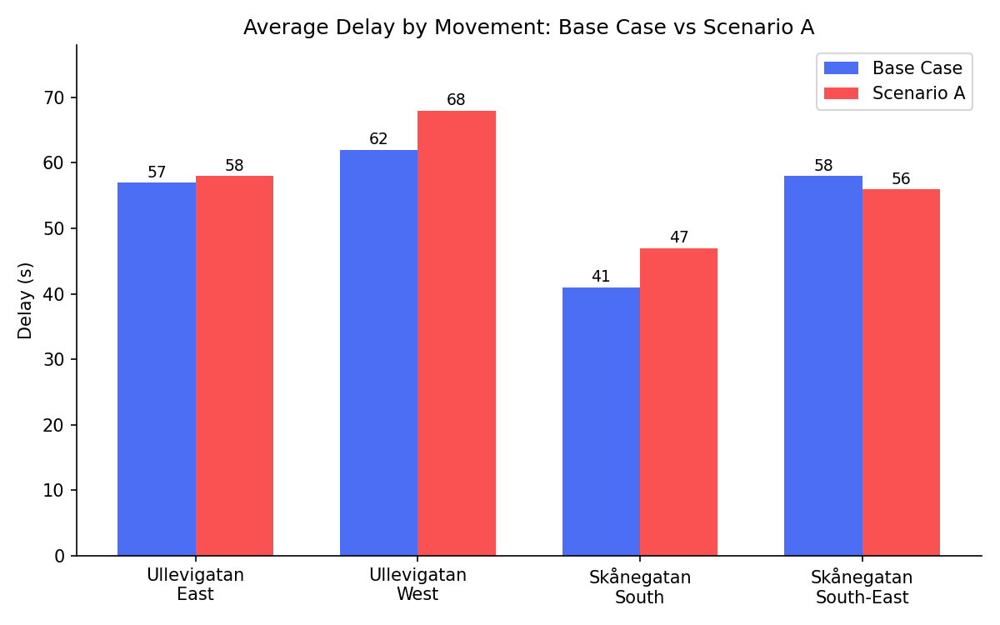

# Microsimulation of Ullevigatan–Skånegatan Intersection (Gothenburg)

**Software:** PTV VISSIM 2026 (Student Version)  
**Location:** Ullevigatan × Skånegatan, Gothenburg, Sweden  
**Author:** Mayowa Daniel Aloko  
**Date:** September 2026

---

## Project Overview

This project develops a microscopic traffic simulation model of a real signalised urban intersection in Gothenburg using PTV VISSIM.  

The main goals were:
- Build a realistic model using open traffic data from 2025
- Evaluate the performance of the current signal timing (Base Case)
- Test an optimised signal timing scenario (Scenario A)
- Compare queue lengths and travel times

---

## Study Area

- Intersection: Ullevigatan (east-west) and Skånegatan (north-south)
- Type: Signalised intersection with tram tracks
- Data source: Göteborgs Stad Trafikmängdskatalogen (2025)

---

## Model Development

The following components were coded in VISSIM:

- Links and Connectors for all approaches and turning movements
- Conflict Areas
- Desired Speed Decisions (urban speed distributions)
- Vehicle Composition (Urban Mix)
- Vehicle Inputs based on 2025 peak-hour volumes
- Fixed-time Signal Controller and Signal Heads
- Queue Counters on all major approaches
- Travel Time Measurements for main movements

**Student Version Limitations:**
- Maximum simulation time: 600 seconds
- Evaluation interval: 20 seconds

---

## Scenarios

### Base Case
- Ullevigatan E-W Green: 48 s
- Skånegatan N-S Green: 26 s
- Turnings: 16 s
- Cycle time: ≈ 105–110 s

### Scenario A (More green for Ullevigatan)
- Ullevigatan E-W Green: 54 s
- Skånegatan N-S Green: 22 s
- Turnings: 14 s
- Cycle time: ≈ 100–105 s

---

## Key Results

### Maximum Queue Length (m)

| Approach                  | Base Case | Scenario A |
|---------------------------|-----------|------------|
| Ullevigatan West          | 66        | 69         |
| Ullevigatan East          | 35        | 36         |
| Skånegatan South          | 33        | 32         |
| Skånegatan South-East     | 18        | 37         |
| North-left turn           | 25        | 24         |

### Average Travel Time (s)

| Movement                  | Base Case | Scenario A |
|---------------------------|-----------|------------|
| Ullevigatan East          | 57        | 58         |
| Ullevigatan West          | 62        | 68         |
| Skånegatan South          | 41        | 47         |
| Skånegatan South-East     | 58        | 56         |

---

## Conclusions

- A complete and functional VISSIM model of a real Swedish intersection was successfully built.
- Giving more green time to Ullevigatan (Scenario A) did not significantly reduce queues or travel times.
- Ullevigatan West remains the most critical approach.
- The model provides a good foundation for future studies (actuated control, public transport priority, etc.).

---

## Repository Structure

- `models/` → VISSIM network files (.inpx)
- `results/` → Raw CSV outputs
- `images/` → Maps and charts
- `docs/` → Project report 

---

## Limitations

- Student version of VISSIM (600-second limit)
- No detailed turning movement counts (routing estimated)
- Fixed-time control only